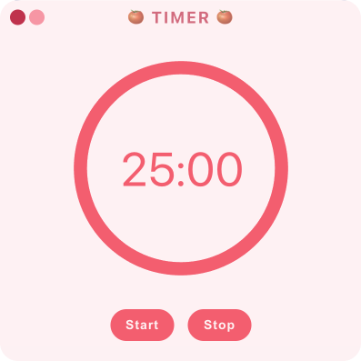
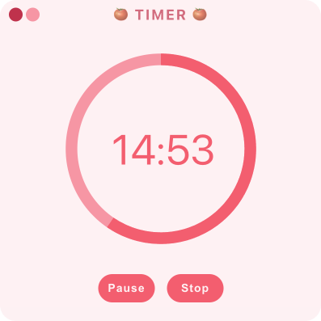
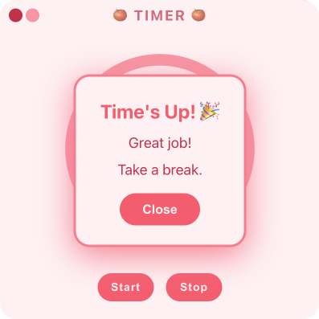

# 🍅 My Cute Timer

<p align="center">
  
  
  
</p>

A minimalist Pomodoro timer desktop application built with Electron, React, and TypeScript. Stay focused and productive with this cute timer that helps you manage your work sessions.

> **Note**: This is my first desktop application! Built as a learning project to explore Electron, React, and TypeScript.

## ✨ Features

- **25-Minute Pomodoro Timer**: Classic Pomodoro technique timer set to 25 minutes
- **Visual Progress Indicator**: Circular progress ring that visually shows time remaining
- **Alarm Notification**: Audio alert when the timer completes
- **Custom Window Controls**: Frameless design with custom minimize and close buttons
- **Start/Pause/Stop Controls**: Full control over your timer sessions
- **Cross-Platform**: Works on Windows, macOS, and Linux

## 🛠️ Technology Stack

- **Electron** - Desktop application framework
- **React** - UI library
- **TypeScript** - Type-safe JavaScript
- **Vite** - Fast build tool and dev server
- **electron-vite** - Electron + Vite integration
- **electron-builder** - Application packaging and distribution
- **React Icons** - Icon library

## � Getting Started

### Try the Web Version (Easiest!)

Don't want to install anything? Try the web version at **[tjllis.github.io/cute-timer-web](https://tjllis.github.io/cute-timer-web/)** - it works directly in your browser!

### Build It Locally

Want the desktop app? Clone this repo and build it yourself:

```bash
git clone https://github.com/tjllis/cute_timer.git
cd cute_timer
pnpm install
pnpm build
```

> **Note**: Pre-built downloads are not recommended as the app is not digitally signed/notarized (especially important for macOS users).

## 🎯 Usage

1. **Start the Timer**: Click the "Start" button to begin a 25-minute Pomodoro session
2. **Pause**: Click "Pause" to temporarily stop the timer
3. **Stop**: Click "Stop" to reset the timer back to 25:00
4. **Notification**: When the timer reaches zero, an alarm will sound and a notification will appear
5. **Window Controls**: Use the minimize and close buttons in the custom title bar

<details>
<summary><strong>📦 Development Setup (Click to Expand)</strong></summary>

### Prerequisites

- Node.js (v16 or higher)
- pnpm (recommended) or npm

### Setup

1. Clone the repository:

```bash
git clone https://github.com/tjllis/cute_timer.git
cd cute_timer
```

2. Install dependencies:

```bash
pnpm install
```

## 🚀 Running Locally

Start the development server with hot reload:

```bash
pnpm dev
```

The app will open in a new window with hot module replacement enabled.

## 🏗️ Building

### Build for Current Platform

```bash
pnpm build
```

### Build for Specific Platforms

```bash
# Windows
pnpm build:win

# macOS
pnpm build:mac

# Linux
pnpm build:linux

# All platforms
pnpm build:all
```

### Build Unpacked (for testing)

```bash
pnpm build:unpack
```

Built applications will be available in the `dist/` directory.

## 📝 Available Scripts

- `pnpm dev` - Start development server
- `pnpm build` - Build for production (with type checking)
- `pnpm build:win` - Build Windows executable
- `pnpm build:mac` - Build macOS application
- `pnpm build:linux` - Build Linux application
- `pnpm build:all` - Build for all platforms
- `pnpm build:unpack` - Build unpacked application
- `pnpm lint` - Run ESLint
- `pnpm typecheck` - Run TypeScript type checking
- `pnpm format` - Format code with Prettier

## 📁 Project Structure

```
my-cute-timer/
├── src/
│   ├── main/           # Electron main process
│   ├── preload/        # Preload scripts
│   └── renderer/       # React application
│       └── src/
│           ├── App.tsx # Main timer component
│           └── assets/ # Audio and image assets
├── resources/          # App icons and resources
├── build/              # Build configuration files
└── dist/               # Built applications
```

## 🎨 Customization

The timer is currently set to 25 minutes (Pomodoro technique). To customize the timer duration, modify the `totalTime` constant in `src/renderer/src/App.tsx`:

```typescript
const totalTime = 25 * 60; // Change 25 to your desired minutes
```

## 🔧 Development Tools

### Recommended IDE Setup

- [VSCode](https://code.visualstudio.com/)
- [ESLint](https://marketplace.visualstudio.com/items?itemName=dbaeumer.vscode-eslint)
- [Prettier](https://marketplace.visualstudio.com/items?itemName=esbenp.prettier-vscode)
</details>

## 📄 License

This project is open source and available under the MIT License.

## 👤 Author

Created with ❤️ as my first desktop application - a learning journey into Electron, React, and TypeScript!

## 🙏 Acknowledgments

This project was built with the help of various tutorials, documentation, and community resources. Special thanks to the Electron and React communities for their excellent documentation.

---

**Note**: This is a desktop application. Make sure you have the necessary permissions to run Electron applications on your system.
